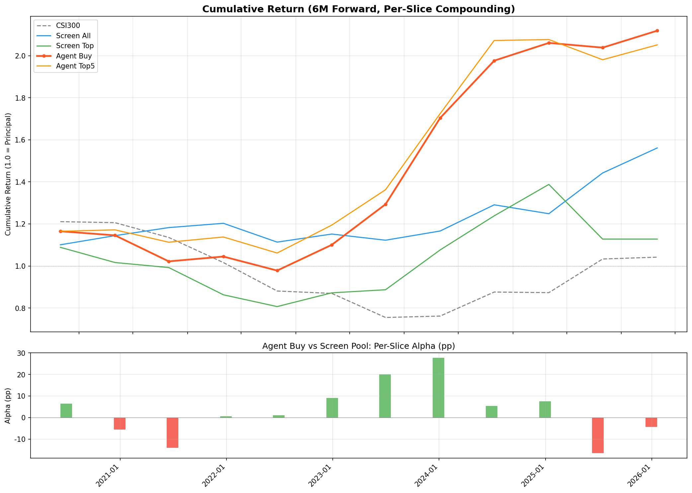
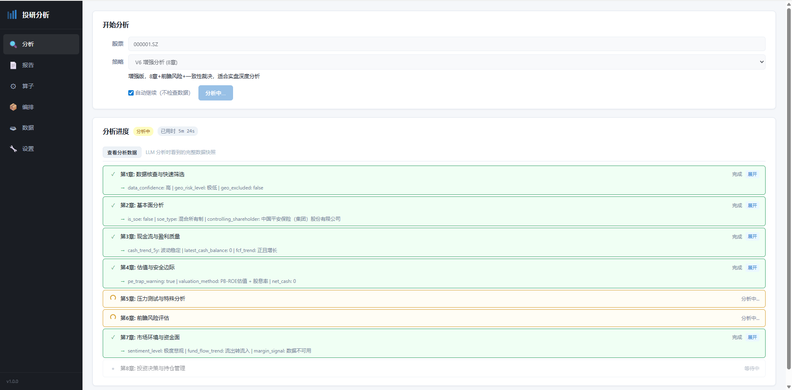
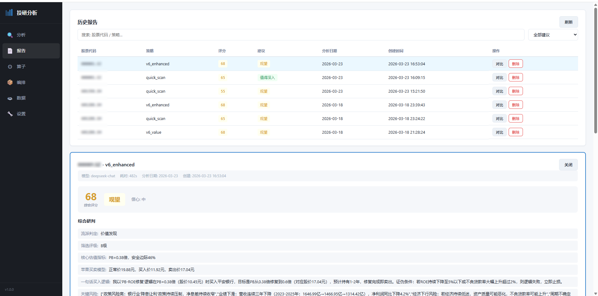
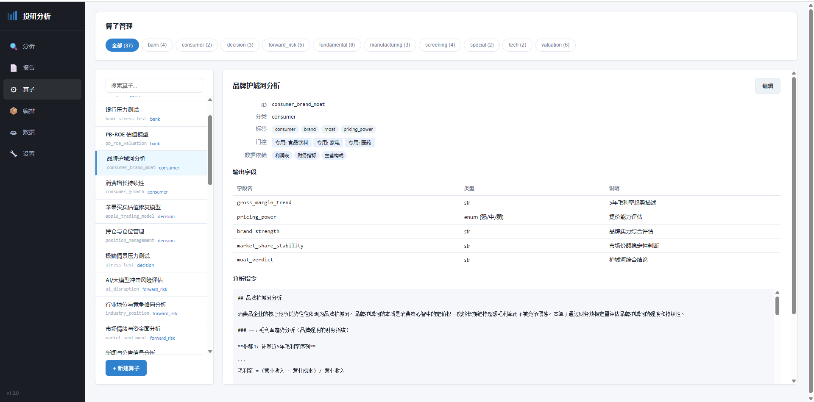
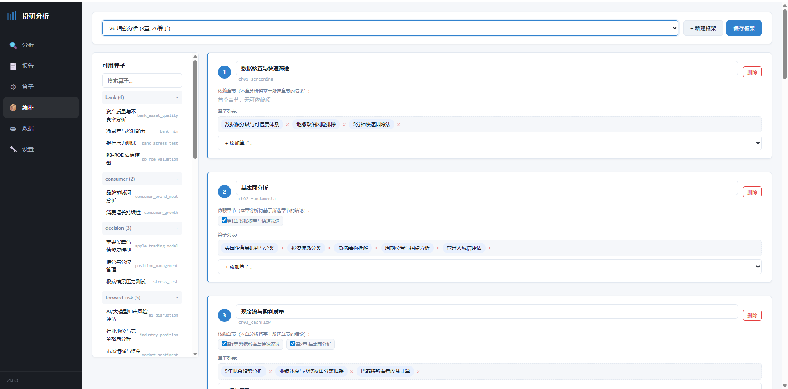
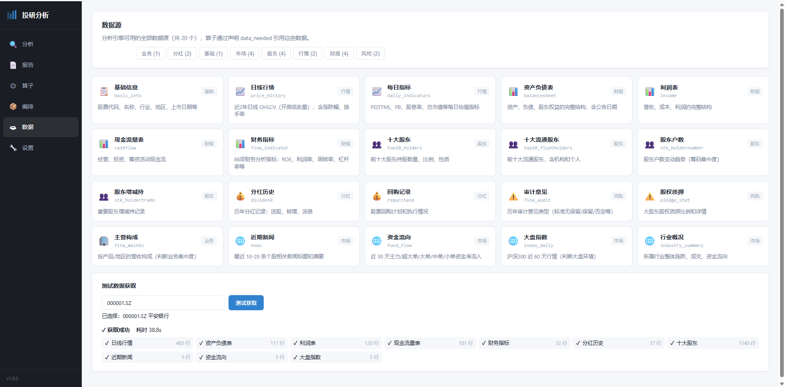
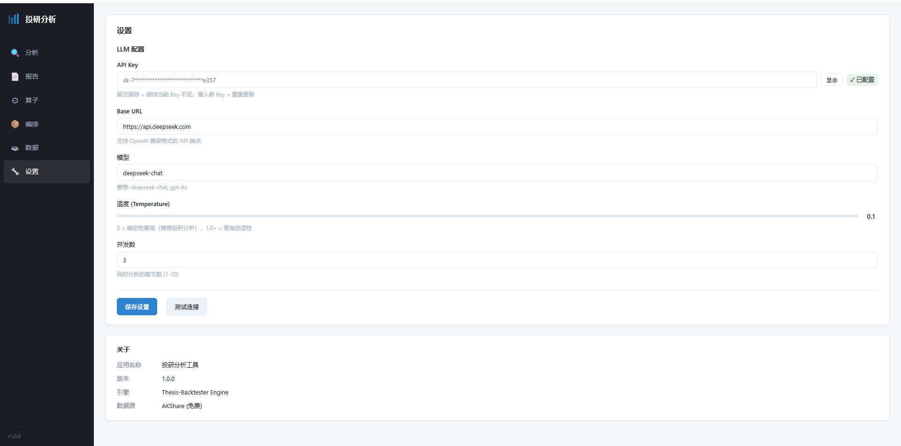

# Thesis Backtester — AI 驱动的投资命题分析与回测框架

> 把定性投资判断变成可回测对象。

让 AI 按研究框架分析投资命题，并用历史回测验证这些判断是否成立。

传统量化回测擅长验证数值规则（比如“PE < 10 就买入”），而 Thesis Backtester 要验证的是更接近真实投资研究的问题：

- 这个高股息能持续吗，还是在透支未来？
- 低 PE 是真便宜还是价值陷阱？
- 管理层是在创造价值还是做资本运作？
- 这个商业模式能撑过下行周期吗？

分析框架被拆成可复用步骤，由引擎按依赖顺序逐步执行，让后一步建立在前一步结论之上，减少单次 Prompt 的跳步和遗漏。

## 当前旗舰案例：V6 价值投资框架

当前 V6 价值投资案例：120 只股票 × 12 个半年截面 × 5 年（2020–2025），五基准对比：

| 基准 | 样本 | 6m 收益 | 胜率 | vs 沪深300 |
|------|------|--------|------|-----------|
| 沪深300 | 12 | +0.9% | 42% | — |
| 筛选池等权 | 600 | +4.0% | 53% | +3.0pp |
| **Agent 买入** | **43** | **+8.1%** | **65%** | **+7.1pp** |



**回避信号更强**：Agent 回避的股票 73% 后续下跌，排雷 alpha（-14.8pp）显著高于选股 alpha（+6.4pp）。

<details>
<summary>Alpha 分解</summary>

```
沪深300        +0.9%
                 │ +3.0pp  量化筛选 alpha
筛选池等权      +4.0%
                 │ +4.1pp  Agent 增量 alpha
Agent 买入      +8.1%    端到端 alpha: +7.1pp
```

排雷 alpha（-14.8pp）vs 选股 alpha（+6.4pp）

</details>

> [完整报告](strategies/v6_value/backtest/backtest_report_20260316_1448.md) · [结构化数据](strategies/v6_value/backtest/backtest_summary_20260316_1448.json) · [120 份分析报告](strategies/v6_value/backtest/agent_reports/)

## 3 分钟快速体验

> 完成下方"安装与配置"后，可先运行：

```bash
# ① 分析一只股票（免费公开数据）
python -m src.engine.launcher strategies/v6_enhanced/strategy.yaml live-analyze 601288.SH

# ② 或打开投研分析工具
python src/desktop/main.py
```



<details>
<summary>查看分析平台更多截图</summary>







</details>

5 个预设框架：

| 框架 | 章节 | 定位 |
|------|------|------|
| V6 价值投资 | 6 章 | 回测验证版（+7.1pp alpha） |
| **V6 增强分析** | **8 章** | **深度分析 + 前瞻风险 + 一致性裁决** |
| 快速评估 | 3 章 | 10-15 分钟快速判断 |
| 收息型分析 | 5 章 | 高股息可持续性专用 |
| 银行专项分析 | 6 章 | 银行业专用算子 + 行业特异性指标 |

## 为什么不是普通的 AI 股票分析

- **不是一次性问答**，而是按固定研究框架逐章分析
- **不是松散多轮对话**，而是前一步结论显式传给后一步
- **不是只给当下观点**，而是可以放回历史里做回测验证

## 核心设计

```
strategy.yaml                    一站式配置：筛选 + 分析框架 + 评分体系 + LLM
       │
       ▼
┌─── Engine ──────────────────────────────────────────────────────┐
│  StrategyConfig · Launcher · OperatorRegistry · FactorRegistry  │
└──────┬──────────────┬───────────────────┬───────────────────────┘
       │              │                   │
  ┌────▼────┐   ┌─────▼──────┐   ┌───────▼────────┐
  │Screener │   │   Agent    │   │   Backtest      │
  │量化筛选  │   │ 37算子DAG  │   │  Pipeline       │
  │ 因子评分 │   │ 三层评分   │   │ screen → agent  │
  └────┬────┘   └─────┬──────┘   │   → eval        │
       │              │          └───────┬────────┘
┌──────▼──────────────▼─────────────────▼───────────────────────┐
│  Data Layer: Provider抽象 · Parquet存储 · 时点快照 · 查询API   │
└───────────────────────────────────────────────────────────────┘
```

| 设计 | 做法 |
|------|------|
| **算子驱动** | 37 个 `.md` 算子，策略通过 YAML 组合，无需写代码 |
| **盲测** | 隐藏公司名称，消除 AI 品牌偏见和记忆污染 |
| **时间边界** | 数据层按公告日过滤 + Prompt 注入 + 工具沙盒，三层防护 |
| **三层评分** | 思考步骤引导推理 → 评分锚点校准 → 决策边界强制一致 |
| **五基准对比** | 沪深300 / 筛选池 / Top 评级 / Agent 买入 / Agent Top5 |

<details>
<summary>Agent 分析流程（DAG 依赖图）</summary>


</details>

<details>
<summary>回测 Pipeline（三步独立）</summary>

```bash
python -m src.engine.launcher strategies/v6_value/strategy.yaml backtest-screen   # ① 筛选（秒级）
python -m src.engine.launcher strategies/v6_value/strategy.yaml backtest-agent    # ② Agent（小时级）
python -m src.engine.launcher strategies/v6_value/strategy.yaml backtest-eval     # ③ 评估（分钟级）
```

每步独立，可中断/续跑。Agent 自动跳过已完成的分析。

</details>

## 安装与配置

```bash
pip install -e .
export LLM_API_KEY="your_key"
export LLM_BASE_URL="https://api.deepseek.com"
```

<details>
<summary>回测模式（需要 Tushare）</summary>

```bash
export TUSHARE_TOKEN="your_token"

# 数据初始化
python -m src.engine.launcher data init-basic
python -m src.engine.launcher data init-market 2020-01-01

# 量化筛选
python -m src.engine.launcher strategies/v6_value/strategy.yaml screen 2024-06-30

# 回测 Pipeline
python -m src.engine.launcher strategies/v6_value/strategy.yaml backtest-screen
python -m src.engine.launcher strategies/v6_value/strategy.yaml backtest-agent
python -m src.engine.launcher strategies/v6_value/strategy.yaml backtest-eval
```

</details>

<details>
<summary>创建自己的策略</summary>

1. 创建 `strategies/<name>/strategy.yaml`（参考 [v6_value](strategies/v6_value/strategy.yaml) 的完整注释版）
2. 定义量化筛选条件（`screening`）
3. 组合算子为章节（`framework.chapters`）
4. 运行 `backtest-screen` → `backtest-agent` → `backtest-eval`

无需编写代码，输出 Schema 从算子 `outputs` 字段自动生成。

</details>

<details>
<summary>目录结构</summary>

```
src/
├── engine/        # 引擎层：配置 + 启动器 + 注册表
├── data/          # 数据层：Provider + Parquet + 快照 + 免费爬虫
├── agent/         # Agent层：LLM 分析（DAG调度 + tool_use）
├── screener/      # 筛选层：声明式量化筛选
├── backtest/      # 回测层：三步 Pipeline + 五基准评估
└── desktop/       # 桌面端：FastAPI + Vue 3 投研分析工具

operators/v1/      # 算子库 v1（21 个，冻结，绑定回测结果）
operators/v2/      # 算子库 v2（37 个，含前瞻风险 + 行业专项算子）
strategies/        # 策略实例（5 个预设框架 + 自定义）
```

</details>

## 适合谁

- 想把投资分析方法论结构化、可复用的人
- 想测试 AI 是否能按研究框架稳定分析股票的人
- 想复现投资命题回测（thesis backtesting）思路的开发者

**不适合**：高频交易引擎、通用量化回测平台、零配置实盘交易工具。

## 当前边界

当前最完整验证的是 V6 价值投资案例；其他预设框架更偏分析工具，尚未达到同等回测验证强度。结果主要基于 A 股价值投资场景，跨市场、跨模型的泛化能力仍在持续验证中。

## 路线图

| 时间 | 计划 |
|------|------|
| **2026 Q2** | 模拟盘第一期：沪深300 全量 Agent 评估 → Top 15 持仓 → 公开发布 → 年底对账 |
| **2026 H2** | 三层生产架构：财报驱动评估（季度）+ 价格信号监控（每日）+ 资讯校验（触发时） |
| **持续迭代** | 算子持续优化 · 样本扩大（120 → 500+）· 多策略对比 · 季度截面 |

## 技术方向

- 算子 gate 引擎级强制执行（当前仅声明，由 LLM 自行遵守）
- 分析结果缓存（同一天同股票复用已有数据）
- 多 LLM 横评（DeepSeek / GPT / Claude 同策略对比）
- 更多免费数据源接入（巨潮公告全文、研报摘要）

## 文档

- [架构](docs/design/architecture.md) · [Agent](docs/design/agent.md) · [数据层](docs/design/data_layer.md) · [算子](docs/design/operators.md) · [筛选](docs/design/screener.md) · [回测](docs/design/backtest.md) · [评分](docs/design/scoring.md) · [实时分析](docs/design/live_analysis.md)

## 许可证

AGPL-3.0 License

## 免责声明

本工具仅用于**投资方法论研究与验证**，不构成投资建议。历史回测结果不代表未来表现。

---

[English](README_en.md)
