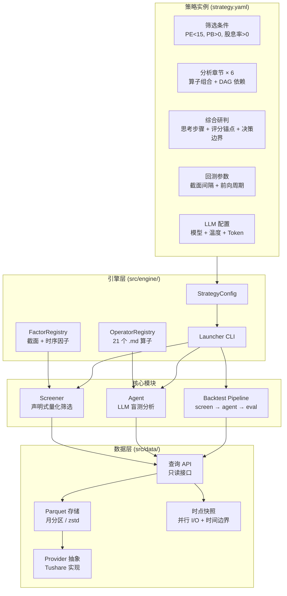
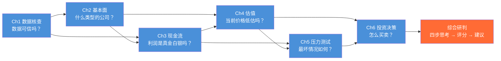

# Thesis Backtester — AI 驱动的投资分析框架

> 策略配置 → 量化筛选 → LLM 多章深度分析 → 多基准回测验证

**Thesis Backtester** 是一个开源引擎，用 LLM 驱动的盲测分析来回测*定性*投资思路。传统量化回测只能验证数值化规则（"PE<10 就买入"），而本工具验证的是真实投资者的判断：

- "这个高股息能持续吗，还是在透支未来？"
- "低 PE 是真便宜还是价值陷阱？"
- "管理层是在创造价值还是做资本运作？"
- "这个商业模式能撑过下行周期吗？"

## 回测结果：5 年 120 只股票盲测

用价值投资策略（低PE + 低PB + 高股息 + AI 深度分析）在 **2020-2025 年 12 个半年截面、600 只候选中精选 120 只**做了完整验证。

### 五基准绩效对比 (6 个月前向收益)

| 基准 | 样本 | 平均收益 | 胜率 | vs 沪深300 |
|------|------|---------|------|-----------|
| 沪深300 | 12 | +0.9% | 42% | — |
| 筛选池等权 | 600 | +4.0% | 53% | +3.0pp |
| 筛选池 Top (金龟) | 56 | +4.0% | 57% | +3.0pp |
| **Agent 买入** | **43** | **+8.1%** | **65%** | **+7.1pp** |
| Agent Top5 | 60 | +6.7% | 65% | +5.7pp |

### 累计收益曲线


### Alpha 分层

```
沪深300        +0.9%    ← 全市场基准
                 │ +3.0pp  ← 量化筛选 alpha
筛选池等权      +4.0%
                 │ +4.1pp  ← Agent 增量 alpha
Agent 买入      +8.1%    ← 端到端 alpha: +7.1pp
```

- **量化筛选有效**：低估值+高股息组合跑赢沪深300 3.0pp，胜率 53%
- **Agent 有增量价值**：在筛选基础上再加 4.1pp，胜率从 53% 提升到 65%
- **12 个月 alpha 更强**：Agent 买入 12m 均收益 +13.9%（vs 沪深300 +1.1%，alpha +12.8pp）
- **回避信号有效**：Agent 回避的股票 73% 后续下跌

> 完整报告：[backtest_report](strategies/v6_value/backtest/backtest_report_20260316_1448.md) | 结构化数据：[backtest_summary](strategies/v6_value/backtest/backtest_summary_20260316_1448.json)

## 架构总览



## Agent 分析流程

每只股票经过六章结构化分析，章节间有 DAG 依赖关系：



**盲测协议**：隐藏公司名称 → 消除 AI 品牌偏见和记忆污染

**时间边界**：三层防护（数据层按公告日硬过滤 + Prompt 注入截止日期 + Agent 工具沙盒限制查询范围）

**三层评分**：

```mermaid
graph LR
    A[算子层<br/>21 个算子<br/>解决"看什么"] --> B[章节层<br/>6 章 DAG<br/>解决"看的顺序"]
    B --> C[综合层<br/>思考步骤 + 评分锚点<br/>解决"怎么判断"]
    C --> D{评分 0-100}
    D -->|≥70| BUY[买入]
    D -->|30-69| WATCH[观望]
    D -->|≤29| AVOID[回避]

    style BUY fill:#4CAF50,color:#fff
    style WATCH fill:#FF9800,color:#fff
    style AVOID fill:#F44336,color:#fff
```

## 回测 Pipeline

```mermaid
graph LR
    subgraph S1["Step 1: backtest-screen"]
        D1[strategy.yaml<br/>起止日期 + 间隔] --> D2[生成截面日期<br/>月末对齐]
        D2 --> D3[逐截面筛选<br/>50只/截面]
        D3 --> D4[保存 CSV]
    end

    subgraph S2["Step 2: backtest-agent"]
        A1[读取 CSV] --> A2[并发 Agent 分析<br/>10 并发]
        A2 --> A3[进度/重试/增量]
        A3 --> A4[保存报告<br/>JSON + MD]
    end

    subgraph S3["Step 3: backtest-eval"]
        E1[读取 CSV + 报告] --> E2[采集前向收益<br/>带缓存]
        E2 --> E3[五基准绩效评估]
        E3 --> E4[输出报告 + 曲线图]
    end

    D4 --> A1
    A4 --> E1

    style S1 fill:#E3F2FD
    style S2 fill:#FFF3E0
    style S3 fill:#E8F5E9
```



每步独立运行，可随时中断/续跑。Agent 自动跳过已完成的分析。

```bash
python -m src.engine.launcher strategies/v6_value/strategy.yaml backtest-screen   # 秒级
python -m src.engine.launcher strategies/v6_value/strategy.yaml backtest-agent    # 小时级
python -m src.engine.launcher strategies/v6_value/strategy.yaml backtest-eval     # 分钟级
```

## 关键设计

| 设计 | 做法 | 为什么 |
|------|------|--------|
| **算子驱动** | 21 个 `.md` 算子，策略通过 YAML 组合 | 分析逻辑可复用、可组合、可独立演进 |
| **盲测** | 隐藏公司名称和代码 | 消除 AI 品牌偏见和训练记忆污染 |
| **时间边界** | 数据层按公告日过滤 + Prompt 注入 + 工具沙盒 | 三层防护杜绝前视偏差 |
| **三层评分** | 思考步骤 → 评分锚点 → 决策边界 | 引导推理而非套公式，保留 LLM 判断力 |
| **五基准对比** | 沪深300 + 筛选池 + 金龟 + Agent 买入 + Top5 | 分离量化 alpha 和 Agent 增量 alpha |
| **策略即配置** | `strategy.yaml` 一站式定义 | 新投资理念无需写代码 |
| **Provider 抽象** | 数据源通过 Protocol 解耦 | 换数据源只需实现接口 |

## 快速开始

### 环境

```bash
pip install -e .
export TUSHARE_TOKEN="your_token_here"  # Tushare Pro 账号
export LLM_API_KEY="your_key_here"      # OpenAI 兼容 API
export LLM_BASE_URL="https://api.deepseek.com"  # 推荐 DeepSeek
```

### 数据初始化

```bash
python -m src.engine.launcher data init-basic              # 股票列表 + 交易日历
python -m src.engine.launcher data init-market 2020-01-01  # 日线行情 + 指标 + 因子
python -m src.engine.launcher data daily-update            # 日常增量更新
```

### 单次分析

```bash
# 量化筛选
python -m src.engine.launcher strategies/v6_value/strategy.yaml screen 2024-06-30

# 单股 Agent 盲测分析
python -m src.engine.launcher strategies/v6_value/strategy.yaml agent-analyze 601288.SH 2024-06-30
```

### 创建自己的策略

1. 创建 `strategies/<name>/strategy.yaml`（参考 [v6_value](strategies/v6_value/strategy.yaml) 的完整注释版）
2. 在 `screening` 部分定义量化筛选条件
3. 在 `framework.chapters` 部分组合已有算子（或在 `operators/` 创建新算子）
4. 运行 `backtest-screen` → `backtest-agent` → `backtest-eval`

无需编写代码，输出 Schema 从算子 `outputs` 字段自动生成。

## 目录结构

```
src/
├── engine/        # 引擎层：配置 + 启动器 + 注册表
├── data/          # 数据层：Provider + Parquet + 快照
│   └── tushare/   #   Tushare Provider 实现
├── agent/         # Agent层：LLM盲测（DAG调度 + tool_use）
├── screener/      # 筛选层：声明式量化筛选
├── backtest/      # 回测层：三步 Pipeline + 五基准评估
└── web/           # Web层：Streamlit 工作台

factors/           # 量化因子定义（.py, 截面+时序）
operators/         # 定性分析算子（.md, 21个）
strategies/        # 策略实例
└── v6_value/      #   V6 价值投资（含完整回测数据）
    ├── strategy.yaml       # 配置（带完整注释）
    └── backtest/           # 回测结果
        ├── agent_reports/  #   120份 Agent 分析报告
        ├── screen_results/ #   12个截面筛选 CSV
        └── backtest_chart_*.png  # 收益曲线图
```

## 文档

- [整体架构](docs/design/architecture.md) — 系统分层与模块职责
- [Agent 运行时](docs/design/agent.md) — DAG 调度、Prompt 组装、工具沙盒
- [数据层](docs/design/data_layer.md) — Provider 抽象、Parquet 存储、时点快照
- [算子与因子](docs/design/operators.md) — 21 个算子清单、自动 Schema、行业门控
- [筛选层](docs/design/screener.md) — 声明式量化筛选引擎
- [回测层](docs/design/backtest.md) — 三步 Pipeline、五基准评估
- [评分设计](docs/design/scoring.md) — 三层评分哲学
- [扩展计划](docs/scaling_plan.md) — 从 120 到 600+ 样本的路线图

## 技术栈

| 组件 | 技术选型 |
|------|---------|
| 语言 | Python 3.9+ |
| 数据存储 | Parquet (zstd 压缩, 月/股票分区) |
| LLM 接口 | OpenAI 兼容 API (async, tool_use) |
| 数据源 | Tushare Pro API (Provider 抽象) |
| Web | Streamlit |

## 贡献

项目早期阶段，欢迎参与：

- **新策略实例** — 带上你自己的投资理念，创建 `strategy.yaml` 组合算子
- **新分析算子** — 在 `operators/` 添加 `.md` 文件即可
- **数据源适配** — 实现 `DataProvider` Protocol 接入港股/美股
- **多模型对比** — DeepSeek/GPT/Gemini 横评

## 许可证

Apache License 2.0

## 免责声明

本工具仅用于**投资方法论研究与验证**，不构成投资建议。历史回测结果不代表未来表现。投资有风险，决策需谨慎。

---

[English](README_en.md)
