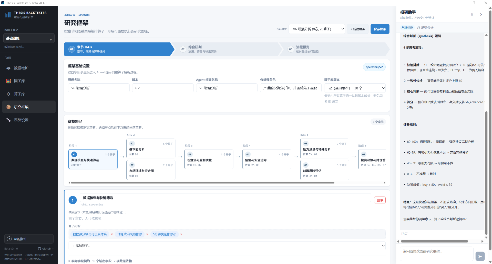
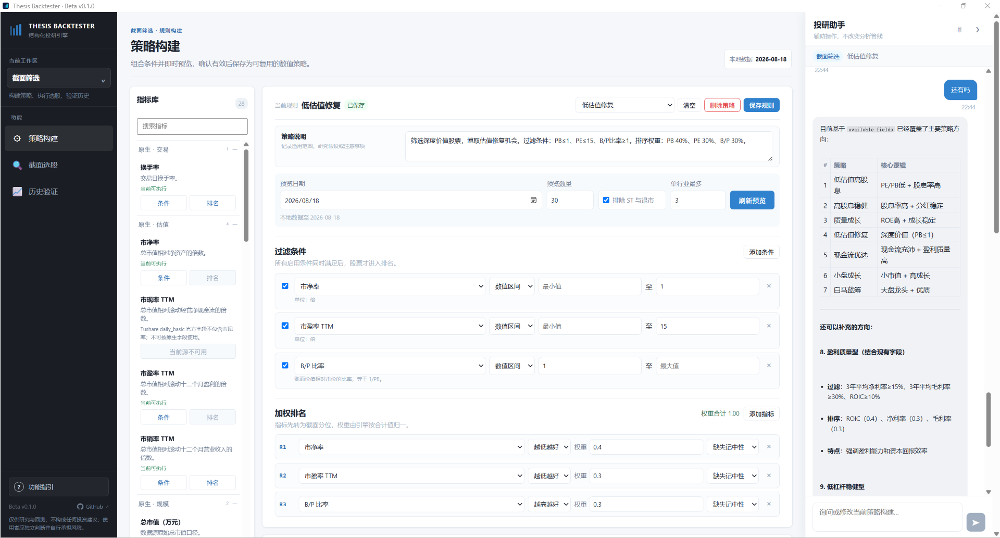
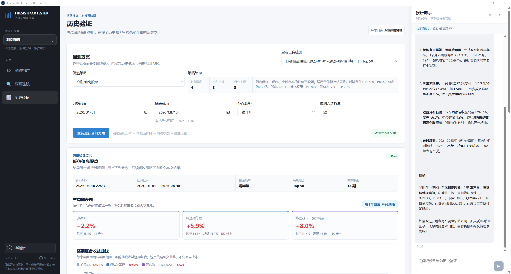
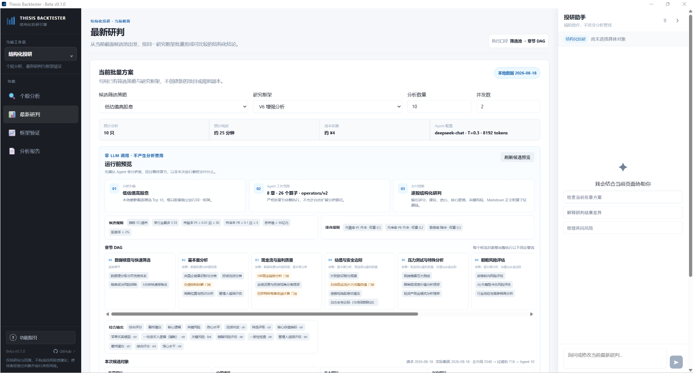
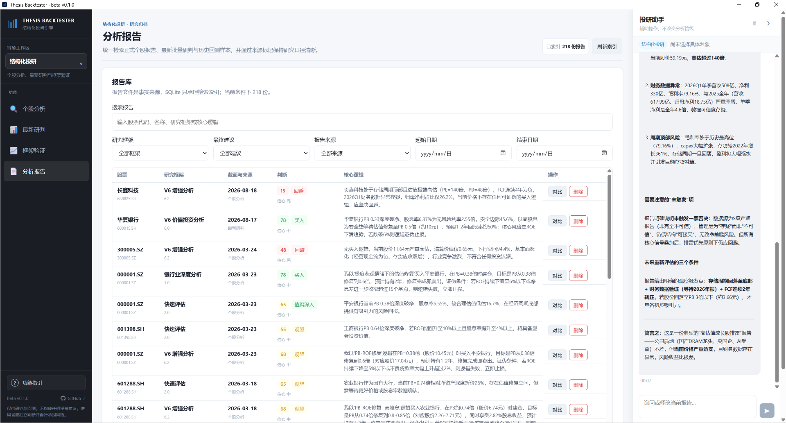

# Thesis Backtester

> 结构化投研引擎：把投资论点组织为可复用算子、确定性研究流程和可验证的历史实验。

Thesis Backtester 是一个面向 A 股研究的本地优先应用。它把数值筛选、定性分析、历史验证和报告管理放在同一套数据口径下，并让 LLM 在既定研究管线中辅助工作，而不是用自由对话替代研究流程。

传统量化回测擅长验证“PE 小于 10”一类数值规则。本项目进一步尝试验证更接近真实投研的问题：

- 高股息是否可持续，还是在透支未来？
- 低估值是真便宜，还是价值陷阱？
- 管理层是在创造长期价值，还是进行短期资本运作？
- 同一套研究框架放回历史截面后，是否仍有增量判断力？

## 核心方法

项目的核心不是聊天界面，而是**算子 + 层级编排**：

- **算子**描述边界明确、可复用的研究方法，包括输入数据、分析步骤、输出字段和结论约束。
- **研究框架**先按分析方向组合多个算子，再通过章节依赖形成固定 DAG。
- **执行引擎**严格按照 DAG 运行，保存每章证据、结构化输出和综合判断。
- **投研助手**读取当前页面的结构化状态，通过与人工相同的既有 API 辅助解释和修改；正式分析仍由确定性管线执行。
- **历史验证**在历史截面冻结数据、筛选策略和框架。仅当前可用的算子会替换为输出契约一致的历史实现；无法安全替换时才阻止运行，不会静默跳过。

```text
数据源 → Provider 独立 SQLite → 原生字段 / 派生因子
                                      │
                 ┌────────────────────┴────────────────────┐
                 ▼                                         ▼
        数值筛选策略                               算子 → 章节 → 研究 DAG
          │        │                                       │
          ▼        ▼                                       ▼
      截面选股   历史验证                         个股分析 / 批量研判
          │                                                │
          └──────────────→ 框架验证 ←──────────────────────┘
                                      │
                                      ▼
                              报告、证据与绩效
```

截面筛选不依赖定性结论；结构化投研可以单向引用已保存的筛选策略或候选池。

## 桌面应用



应用同时支持原生桌面窗口和浏览器访问，包含三个工作区：

| 工作区 | 功能 |
|---|---|
| **基础设施** | 数据维护、因子库、算子库、研究框架、系统设置 |
| **截面筛选** | 策略构建、指定日期截面选股、多截面历史验证 |
| **结构化投研** | 个股分析、最新批量研判、框架历史验证、分析报告 |

每个功能页面拥有独立的助手上下文和对话历史。右侧助手默认开启，但不会在运行期间动态改变 DAG。

<details>
<summary>查看关键工作流界面</summary>

### 策略构建



### 历史验证



### 最新研判



### 分析报告



</details>

[查看基础设施、截面筛选与结构化投研的完整界面图览](docs/SCREENSHOTS.md)。

## 数据口径

项目只有一个应用，不区分社区版和内部版；BaoStock、Tushare 与 AKShare 是边界不同的独立适配器。

| Provider | 定位 | 历史本地库 | 主要边界 |
|---|---|---:|---|
| **BaoStock（默认）** | 免费历史行情与基础估值基线 | 是 | 可完成行情、复权、基础估值和有限季度指标研究；不是完整三大财务报表口径 |
| **Tushare Pro** | 订阅型完整历史基线 | 是 | 行情、估值、财报和治理覆盖取决于 Token 权限与套餐 |
| **AKShare** | 免费即时分析 | 否 | 用于当前公开数据、新闻和市场上下文，不参与严格历史数据库补齐 |

BaoStock 与 Tushare 分别写入 `workspace/data/providers/<provider>/market.db`。单次分析、筛选或回测只读取当前 Provider，不会从其他数据源静默补字段。行情、复权因子和估值快照按交易日原子提交；财务数据按安全检查点续传，中断后可以继续增量维护。

完整设计见[数据层文档](docs/design/data_layer.md)。

## 快速开始

要求 Python 3.9+ 和 [uv](https://docs.astral.sh/uv/)。项目始终使用自己的 `.venv`：

```bash
git clone https://github.com/turtlequant/thesis-backtester.git
cd thesis-backtester

# 创建或同步项目独立环境
uv sync

# 启动桌面应用
uv run python -m src.desktop.main
```

启动后会打开原生窗口，也可以在本机浏览器访问：

```text
http://127.0.0.1:18721
```

推荐的首次使用顺序：

1. 在“基础设施 → 系统设置”中选择 Provider；如使用 Tushare，配置 Token。
2. 在“数据维护”中初始化股票列表、交易日历、行情和所需财务数据。
3. 如需结构化投研，在系统设置中配置 OpenAI 兼容的 LLM 地址、模型与 API Key。
4. 先在“截面筛选”构建并验证纯数值策略，再按需在“结构化投研”中引用候选池。

不配置 LLM 也可以使用数据维护、因子管理、截面选股和数值历史验证。

## 局域网访问

局域网访问默认关闭。需要从同一网络的笔记本或平板访问时：

1. 打开“基础设施 → 系统设置 → 网络访问”。
2. 开启局域网访问并保存，复制只显示一次的访问口令。
3. 重启应用，使监听地址从 `127.0.0.1` 切换为 `0.0.0.0`。
4. 在其他设备打开设置页显示的地址并输入口令。

本机访问不需要登录；远程 HTTP API 和 WebSocket 使用同一会话保护。重置口令会立即使旧远程会话失效。远程用户登录后与本机用户拥有相同的研究和配置权限，因此只应在可信的专用网络中开启。

## 命令行

桌面应用覆盖了主要工作流，CLI 适合自动化和复现实验。所有命令都通过 `uv run` 在项目环境中执行。

```bash
# 查看与初始化当前数据源
uv run python -m src.engine.launcher data status
uv run python -m src.engine.launcher data init-basic
uv run python -m src.engine.launcher data init-market 2020-01-01
uv run python -m src.engine.launcher data update-financials
uv run python -m src.engine.launcher data daily-update

# 单股结构化分析
uv run python -m src.engine.launcher \
  workspace/strategies/v6_enhanced/strategy.yaml live-analyze 601288.SH

# 数值筛选
uv run python -m src.engine.launcher \
  workspace/strategies/v6_value/strategy.yaml screen 2024-06-30

# 可中断、可续跑的三步历史实验
uv run python -m src.engine.launcher \
  workspace/strategies/v6_value/strategy.yaml backtest-screen
uv run python -m src.engine.launcher \
  workspace/strategies/v6_value/strategy.yaml backtest-agent
uv run python -m src.engine.launcher \
  workspace/strategies/v6_value/strategy.yaml backtest-eval
```

## 已有研究样例

开发过程中完成过一组 V6 价值投资框架历史实验：120 只股票、12 个半年截面、2020–2025 年区间。

| 组合 | 样本 | 6 个月收益 | 胜率 | 相对沪深 300 |
|---|---:|---:|---:|---:|
| 沪深 300 | 12 | +0.9% | 42% | — |
| 筛选池等权 | 600 | +4.0% | 53% | +3.0pp |
| **Agent 买入** | **43** | **+8.1%** | **65%** | **+7.1pp** |

详细报告、结构化结果和分析样本属于运行产物，不进入公开源码或标准程序包。这是一份研究样例，不代表软件、框架或模型在未来必然有效。

## 项目结构

```text
src/
├── desktop/       # Thesis Backtester：FastAPI、Vue 3、pywebview、局域网访问
├── data/          # Provider、SQLite、下载任务、因子物化、时点快照
├── engine/        # 策略配置、算子与因子注册、CLI
├── agent/         # 固定 DAG 调度、LLM 客户端、受限工具与输出契约
├── screener/      # 纯数值筛选
└── backtest/      # 截面实验、前瞻收益与多基准评估

workspace/         # 可整体备份和迁移的研究工作区
├── factors/       # 声明式派生因子定义
├── operators/v1/ # 冻结算子版本，绑定已有研究结果
├── operators/v2/ # 当前算子、行业算子与内部历史适配实现
├── screening_strategies/ # 独立的数值筛选策略
├── strategies/    # 研究框架、分析报告和回测产物
└── data/          # 本地数据库和运行时状态，不作为源码提交
docs/              # 产品、架构与研究记录
```

## 开发与验证

```bash
uv run pytest -q
uv run ruff check src tests
```

框架、算子、因子、报告、运行时配置、聊天记录和本地数据库统一位于 `workspace/`。备份或迁移时复制整个工作区即可；前端依赖随仓库提供，不依赖启动时访问 CDN。

### Windows 发布包

使用 Nuitka 生成独立目录版，并自动完成运行时自检与 ZIP 打包：

```powershell
powershell -ExecutionPolicy Bypass -File scripts\build_windows.ps1 -Clean
```

标准产物位于 `dist/ThesisBacktester-<stage>-v<version>-windows-x64/`，同次构建还可生成不含凭据和 BaoStock 数据的私有 Tushare 基线包。发布版本统一在 `src/version.py` 中维护，完整说明见 [Windows 打包与发布](docs/PACKAGING.md)。

## 文档

- [文档索引](docs/README.md)
- [产品功能指引](docs/PRODUCT_GUIDE.md)
- [整体架构](docs/design/architecture.md)
- [数据层](docs/design/data_layer.md)
- [因子库](docs/design/factor_library.md)
- [算子与编排](docs/design/operators.md)
- [回测设计](docs/design/backtest.md)
- [Windows 打包与发布](docs/PACKAGING.md)

## 当前边界

- 当前重点是 A 股研究，不是跨市场通用交易平台。
- 不包含实盘下单、高频交易或自动资产管理能力。
- BaoStock、Tushare 和 AKShare 的数据质量、范围与稳定性由各自来源决定。
- 结构化分析有效性是一项需要持续验证的研究假设；算子、框架和 LLM 的表现不能脱离样本与时间边界解读。

## 许可证

[AGPL-3.0-or-later](LICENSE)

## 免责声明

本软件及其输出仅用于研究与回测，不构成任何投资建议；数据与分析可能存在误差，使用者应独立判断并自行承担风险。历史回测结果不代表未来表现。

---

[English](README_en.md)
