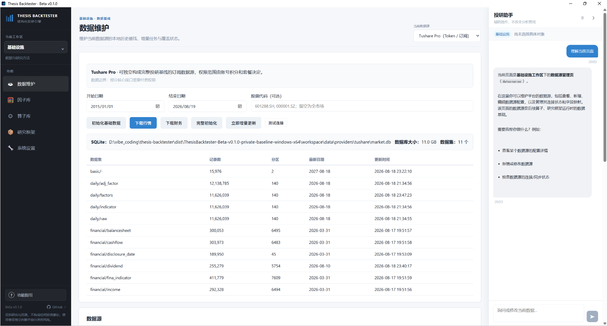
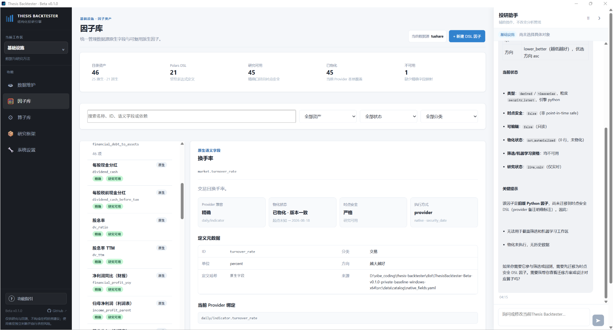
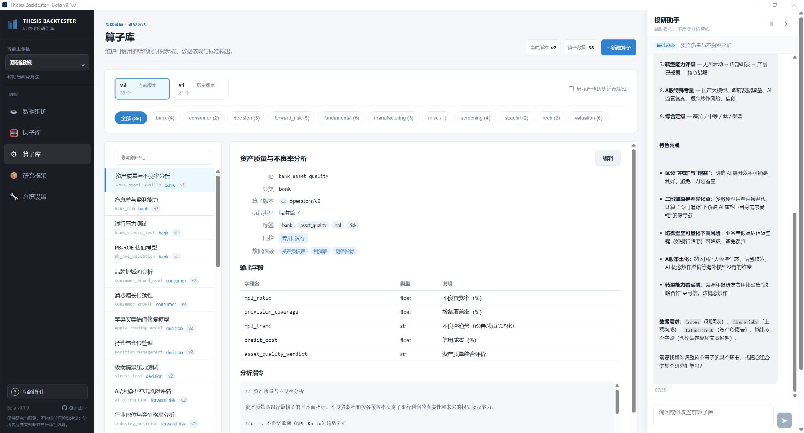
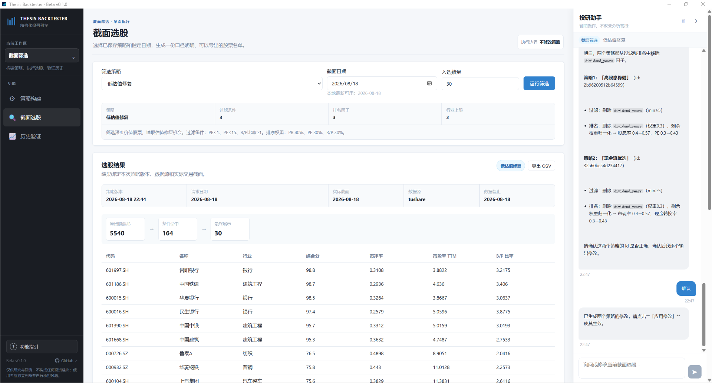
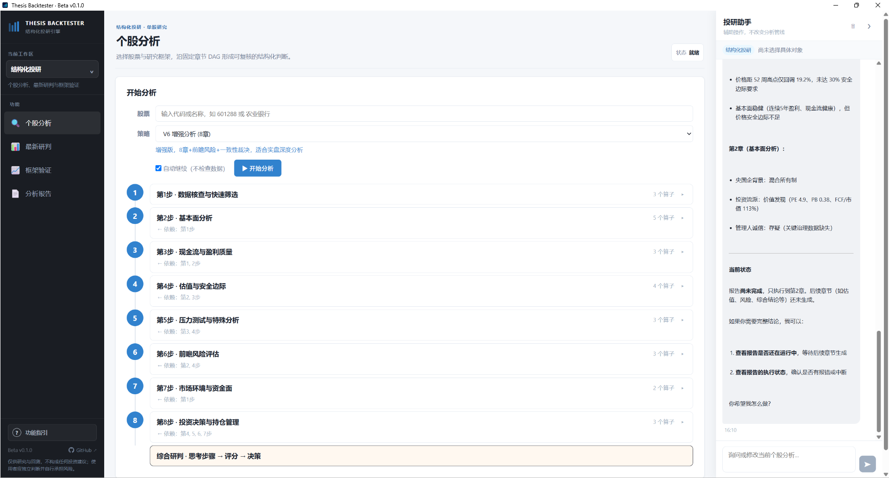
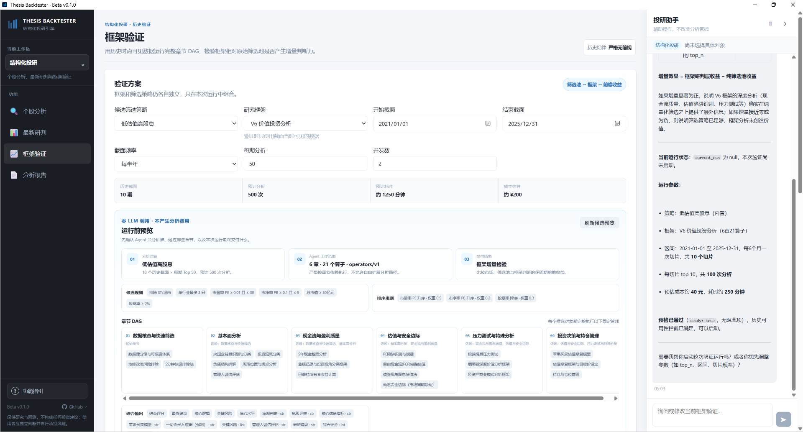

# 应用界面图览 / Application gallery

以下截图对应 `Beta v0.1.0`。应用采用统一的左侧工作区导航、中部确定性功能区和右侧投研助手；助手读取当前页面的结构化上下文并复用相同 API，但不改变正在执行的分析管线。

The screenshots below reflect `Beta v0.1.0`. The application combines workspace navigation on the left, deterministic research functions in the center, and a context-aware research assistant on the right.

## 基础设施 / Infrastructure

### 数据维护 / Data maintenance

维护当前 Provider 的本地历史基线、增量任务与数据集覆盖状态。

### 因子库 / Factor library

统一查看原生字段与派生因子的口径、物化状态、时点安全性和 Provider 绑定。

### 算子库 / Operator library

算子以结构化研究步骤、数据依赖、输出字段和分析约束形成可复用的研究能力。

### 研究框架与章节 DAG / Framework and chapter DAG

一个章节可以组合多个同方向算子，章节之间通过显式依赖形成确定性的研究路径。

## 截面筛选 / Cross-section screening

### 策略构建 / Strategy construction

组合数值过滤条件、加权排序与行业上限，预览后保存为可复用筛选策略。

### 截面选股 / Dated stock selection

按保存的策略和指定历史日期生成结果，明确记录策略、数据源与实际交易截面。

### 历史验证 / Historical validation

冻结筛选策略和回测参数，在多个历史截面比较筛选池、Top 组合与基准表现。

## 结构化投研 / Structured research

### 个股分析 / Single-stock analysis

选择股票与研究框架，严格沿章节 DAG 执行算子并生成可复核结论。

### 最新研判 / Latest batch research

引用已有筛选策略和研究框架，在运行前预览候选池、Agent 工作范围、章节 DAG、耗时与成本。

### 框架验证 / Framework validation

在历史时点批量运行完整研究 DAG，检验结构化判断相对于纯数值筛选是否产生增量效果。

### 分析报告 / Analysis reports

统一检索个股报告、最新研判和历史验证样本，并保留框架、截面、结论和证据来源。

